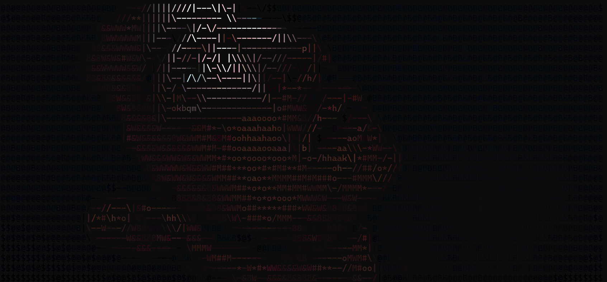

# still-ascii

Convert any image or GIF into ASCII art — right in your terminal.

## Download

Grab the latest Windows exe from [`dist/ascii_image.exe`](dist/ascii_image.exe) — no Python install needed.

---

## Before / After

**Original**


**Art mode**



---

## Usage

### Double-click (Windows)

Just run `ascii_image.exe` — a file picker will open, then a mode selector. The result prints to the terminal window.

### Command line

```
ascii_image.exe <image> [mode] [--width N] [--invert]
```

**Examples**

```bash
ascii_image.exe photo.jpg
ascii_image.exe photo.jpg color
ascii_image.exe photo.jpg art --width 120
ascii_image.exe animation.gif halfblock
```

---

## Modes

| Mode | Description |
|------|-------------|
| `ascii` | Plain ASCII characters (default) |
| `color` | ASCII with true-color per character |
| `blocks` | Unicode block characters (░▒▓█) |
| `colorblocks` | Colored Unicode block characters |
| `halfblock` | High-res color via half-block (▀) — best color fidelity |
| `art` | Color + edge detection + dithering + sharpening |

---

## GIF support

Drop in an animated GIF and it plays in the terminal at the original frame rate. Press **Ctrl+C** to stop.

---

## Build from source

Requires Python 3.10+ and [Pillow](https://python-pillow.org/).

```bash
pip install pillow pyinstaller
pyinstaller --onefile --console ascii_image.py
```

The exe will be in `dist/`.
